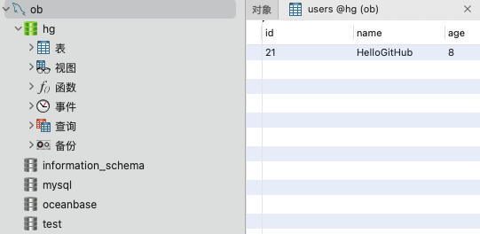

# Python 连接 OceanBase 指南（SQLAlchemy）

本文介绍如何通过 SQLAlchemy ORM 连接 OceanBase 数据库。

## SQLAlchemy 介绍

[SQLAlchemy](https://www.sqlalchemy.org/) 是一个开源的 SQL 工具包和对象关系映射（ORM）系统，用于 Python 应用程序。它提供了全面的数据库功能，包括操作数据库（CRUD 操作）、构建复杂的查询以及映射数据库表到 Python 类。

作为 SQL 工具包，SQLAlchemy 允许开发者编写原生 SQL 语句，同时提供了构建 SQL 的高级接口，使得数据库操作更为直观和安全。

作为 ORM，SQLAlchemy 允许开发者以面向对象的方式处理数据库。这意味着你可以定义 Python 类来表示数据库中的表，并且类的实例对应于表中的行。通过这种方式，你可以用 Python 代码来操作数据库，而不必编写大量的 SQL 代码。

SQLAlchemy 支持多种数据库系统，包括但不限于 OceanBase、PostgreSQL、MySQL、SQLite 等。它还提供了会话管理、事务控制、连接池等高级功能，使得数据库编程更加高效和可靠。

总而言之，SQLAlchemy 是 Python 中一个功能强大且灵活的数据库解决方案，适用于从简单应用到复杂企业级应用的各种场景。


## 安装 OceanBase 数据库

首先，可以选择本地安装 OceanBase 数据库，安装步骤如下：

```
# 下载并安装 all-in-one （需要联网）
bash -c "$(curl -s https://obbusiness-private.oss-cn-shanghai.aliyuncs.com/download-center/opensource/oceanbase-all-in-one/installer.sh)"
source ~/.oceanbase-all-in-one/bin/env.sh

# 快速部署 OceanBase database
obd demo
```

但这里推荐通过[免费试用](https://www.oceanbase.com/free-trial)，无需安装和配置，即可获得一个可用的 OceanBase 数据库实例。


⚠️ 注意：
1. 创建完数据库实例，等待 OceanBase 数据库实例创建完成，点击「实例列表」进入到实例详情页，进行后续操作。
2. 在「数据库实例」页面开通公网地址，点击「实例白名单」添加自己机器的公网 IP。
3. 在「数据库管理」页面创建数据库，用于存储数据。
4. 在「账号管理」页面，点击「创建账号」，创建一个账号，用于连接数据库。

完成以上工作后，可以通过命令行或者图形化工具连接数据库，确保连接信息正确，方便后续的使用。


## 快速开始

为了防止环境问题，推荐使用 anaconda 配置 python 3.x 环境。

在开始之前，需要先确保 SQLAlchemy 已安装：`pip install -r requirements.txt`。

下面，我提供了一个简单的示例代码（[example.py](example.py)），以及一个 [demo](demo) 目录，它包含了使用 SQLAlchemy 的极简目录结构和代码。

### 示例代码

以 [example.py](example.py) 为例，仅需替换文件最上方的 OceanBase 连接信息，即可运行示例代码。

```
# OceanBase 数据库连接参数
username = 'root' # 「账号管理」页面创建的账号
password = '' # 「账号管理」页面创建的账号密码
host = 'localhost' # 「数据库实例」页面开通的公网地址
port = '3306' # 无需改动
database = 'test' # 「数据库管理」页面创建的数据库
```

修改代码中的连接信息，在命令行进入到 `python/sqlalchemy` 目录，直接执行 `python example.py` 运行示例代码，输出结果如下：

```
<User(name=HelloGitHub, age=9)>
<User(name=Alice, age=30)>
<User(name=Bob, age=25)>
<User(name=Alice, age=30)>
<User(name=Bob, age=25)>
```

### 目录结构

上面的 `example.py` 是面条代码，在实际项目中，我们需要更好的组织代码，这里提供了一个极简的目录结构，如下：

```
.
├── db
│   ├── __init__.py
│   ├── base.py     # 基类
│   ├── config.py   # 数据库连接信息
│   ├── curd.py     # 增删改查
│   └── models.py   # 数据库模型
└── main.py               # 入口文件
```

其中，`db` 目录下是数据库相关的代码，`main.py` 是入口文件，代码如下：

```python
from db.base import get_db
from db.curd import insert_user, query_all_user


if __name__ == '__main__':
    with get_db() as db:
        # 新增用户
        insert_user(db, 'HelloGitHub', 8)
        # 查询所有用户
        query_all_user(db)
```

进入到 `python/sqlalchemy/demo` 目录，执行 `python main.py` 即可得到运行结果。

```
<User(name=HelloGitHub, age=8)>
```

最后，通过数据库命令行工具或者图形化工具查看数据库，可以看到新增的用户数据。


